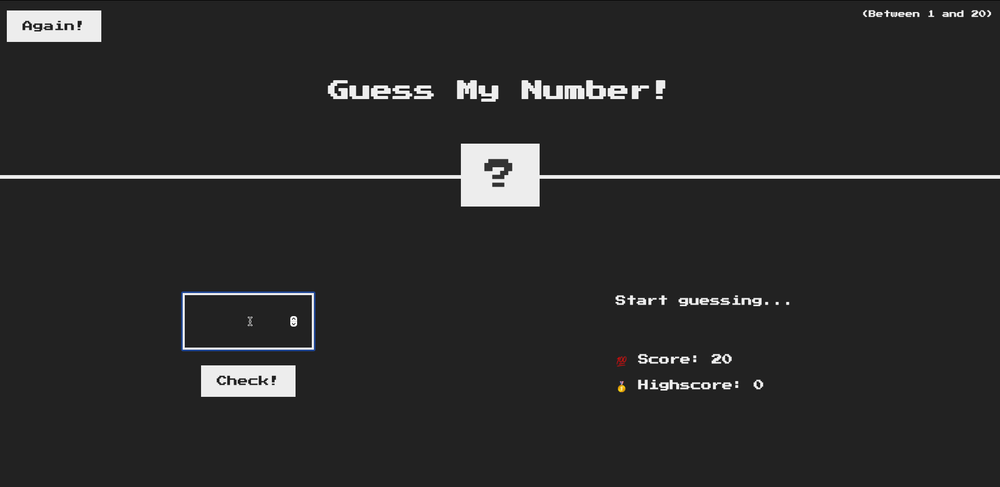

# Guess My Number Game

Welcome to the "Guess My Number" game! This is a simple, interactive number guessing game where you can test your guessing skills. Try to guess the secret number between 1 and 20, and see if you can beat your highscore!

## Game Demonstration

## Table of Contents

- [How to Play](#how-to-play)
- [Features](#features)
- [Technologies Used](#technologies-used)
- [Play Online](#play-online)
- [Game Screenshot](#game-screenshot)

## How to Play

1. Open the game in your web browser.
2. Enter your guess in the input field and click the "Check!" button.
3. The game will provide feedback on whether your guess is too high, too low, or correct.
4. If you guess correctly, the game will display a congratulatory message, and you can play again by clicking the "Again!" button.
5. Try to achieve the highest score possible before running out of guesses!

## Features

- Randomly generated secret number between 1 and 20.
- Interactive feedback on guesses.
- Score tracking and highscore saving.
- Reset functionality to start a new game without refreshing the page.

## Technologies Used

- HTML
- CSS
- JavaScript

## Play Online

You can play the game online at [guessmynumber.ozkanceyhan.dev](http://guessmynumber.ozkanceyhan.dev).

Enjoy the game and happy guessing!
